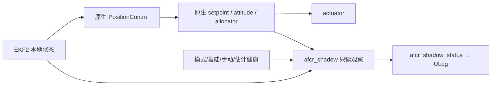

# Candidate 006 实机只读 Shadow Mode 设计

状态：`DESIGN_ONLY`。本轮未将 Candidate 006 编入 FMUv6C 固件，未刷写飞控，未连接 actuator 或 control setpoint。第六轮[安全边界试验](SAFETY_BOUNDARY_RESULT.md)已经发现 failsafe、GPS loss 后候选修正非零；当前主动候选不得用于实机。该设计的目标是以后采集只读 ULog、评估反事实修正；是否进入实机闭环须另行评审和授权。

## 接入位置与权限

拟新增独立 `afcr_shadow` 观察模块，按 `vehicle_local_position_setpoint` 的更新触发，从 uORB 订阅 `vehicle_local_position`、`vehicle_status`、`vehicle_land_detected`、`manual_control_setpoint`、`control_allocator_status` 与必要的 estimator 状态。标称加速度取 PX4 位置控制器已发布的 `vehicle_local_position_setpoint.acceleration`，速度误差取同一设定点的 `vx/vy` 与本地估计的 `vx/vy`，测量加速度取 `vehicle_local_position.ax/ay`。严格按时间戳对齐；时间间隔、状态、设定点或版本不满足契约时输出零和原因码。该外部模块的反事实量与当前 SITL 内部 `_vel_sp`/`_vel_dot` 计算未必逐样本一致，须先通过重放对齐试验量化误差，不能预称数值等价。

`afcr_shadow` **没有**对 `PositionControl`、`vehicle_attitude_setpoint`、`vehicle_rates_setpoint`、`actuator_motors` 或控制分配器的 publication，也没有可打开主动注入的参数。编译目标与模块清单单独审查；启用/关闭 Shadow 的 A/B 台架或 SITL 试验必须证明执行器与主控制 setpoint 不受影响。观察模块崩溃、超时、日志限速或 uORB 队列满时 PX4 主控制仍独立运行。

## 日志契约

建议新增单一、固定布局的 `afcr_shadow_status` uORB 消息，记录 `timestamp`、源数据时间戳与算法规格 SHA 前缀，并进入 logger 固定订阅；记录频率目标 20–50 Hz，具体 CPU/存储开销在 FMUv6C 构建和台架上测量。字段及单位如下：

| 字段 | 含义 |
| --- | --- |
| `candidate_correction_x/y` (m/s²) | 假设主动接入时的有界水平修正，实际输出始终不注入 |
| `raw_residual_x/y` (m/s²) | 测得加速度减去上次标称加速度；含模型误差与噪声，不能标为真实风力 |
| `gated_residual_x/y` (m/s²) | 快慢滤波残差组合乘速度门权重后的贡献；与速度反馈项分开记录 |
| `velocity_error_x/y` (m/s) | 对齐后的水平速度误差，附数据年龄与有效位 |
| `gate_state` / `gate_reason` | 关闭、等待稳定、有效悬停、估计无效、手动输入、模式不符、状态重置、超时或数值失败；原因必须可枚举且版本化 |
| `candidate_saturation` | 每轴限幅或总限幅是否触发，另可记录 allocator 饱和以区分两层限制 |
| `candidate_active` | **反事实计算门已开启**；绝不表示实际控制注入，实际注入位恒为 0 |

不工作时仍定期写入全零修正、`candidate_active=false` 和明确原因，而不是不发布。ULog 分析必须验证 topic 连续性、时间戳单调、禁用期零输出和源状态是否真实有效。日志消息属于审计契约，新增时同步更新 `docs/reference/`、`docs/testing/TEST_MATRIX.md`、logger topic 清单和生成测试。

## 门控与失效闭合

1. 上电默认关闭；只读订阅完整、Position/Loiter、已解锁且已离地、设定点静止并连续 2 s 稳定，才允许 `candidate_active=true`。手动摇杆移动、模式切换、起降、RTL、failsafe、GPS loss、EKF 位置/速度/航向 reset、估计协方差或创新异常、状态时延超限，立即撤销反事实有效位并清空滤波状态。
2. 对齐要求以 `timestamp_sample` 为主；建议初始上限位置/速度状态年龄 40 ms、基线设定点年龄 40 ms、状态与基线偏差 20 ms，作为**待验证的设计值**。超过上限直接零输出并计数，不延用旧修正。候选参数与本轮 SHA 固定，限幅每轴 0.35 m/s²、Z=0、总量 0.5 m/s²；出现 NaN、Inf、异常 dt 或重置计数变化时零输出并重置状态。
3. 禁止将 `candidate_active`、修正或 gate reason 连接到控制仲裁；任何未来主动模式应使用独立版本、独立安全论证和实机审批，不能通过配置切换把本设计直接变成闭环。

## 后续验证顺序

先用本轮 SITL ULog 重放，只读计算结果与原 SITL 内部候选逐样本比较，说明异步采样和积分状态差异；再验证 Shadow on/off 的控制 setpoint 和执行器日志等价、源数据断流、模式/手动/GPS/EKF reset 的零输出、CPU/内存/ULog 带宽与长时运行；最后才考虑 FMUv6C **只读**构建和拆桨台架日志。真实飞行数据采集仍需单独的飞行计划、硬件与传感器健康审查。本轮不执行这些实机步骤。
